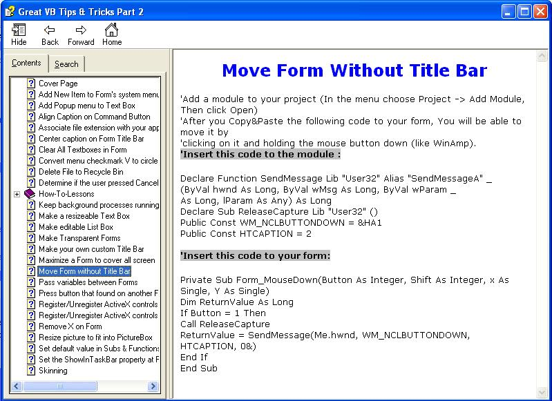



## Great VB Tips and Tricks Part 2

### Description

6,000 Hits in 10 days for part(1) means you like it, here is the 2nd collection of another 32 great VB techniques. Vote if you like it. Part(3) will be comming soon.
 
### More Info
 

             |
---                |---
**Submitted On**   |2005-10-09 18:50:02
**By**             |[VBtutor](https://github.com/Planet-Source-Code/PSCIndex/blob/master/ByAuthor/vbtutor.md)
**Level**          |Intermediate
**User Rating**    |4.9 (123 globes from 25 users)
**Compatibility**  |VB 6\.0
**Category**       |[Miscellaneous](https://github.com/Planet-Source-Code/PSCIndex/blob/master/ByCategory/miscellaneous__1-1.md)
**World**          |[Visual Basic](https://github.com/Planet-Source-Code/PSCIndex/blob/master/ByWorld/visual-basic.md)
**Archive File**   |[Great\_VB\_T1939041092005\.zip](https://github.com/Planet-Source-Code/vbtutor-great-vb-tips-and-tricks-part-2__1-62835/archive/master.zip)

